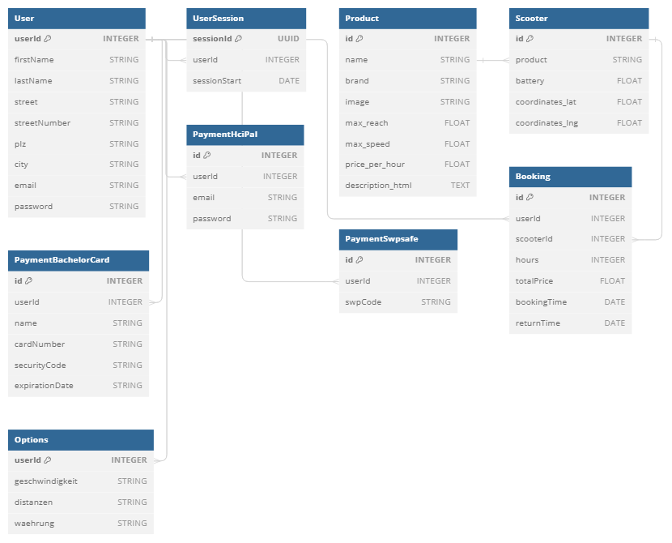
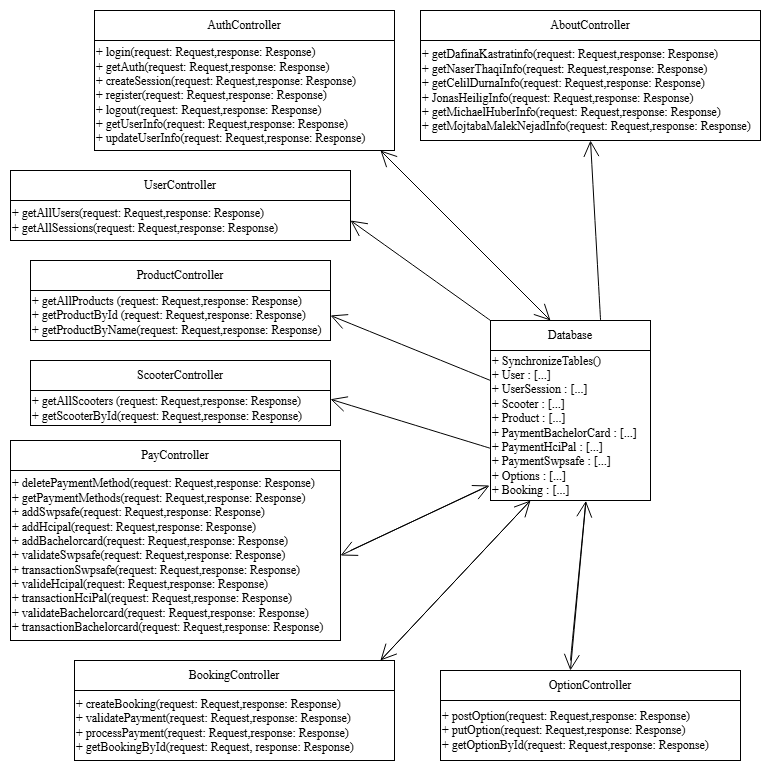

# University Team-Project: Scooter App

This project was developed as part of the *Softwareprojekt* course at the University of Konstanz in a team of five students.  
It is a scooter web app with an interactive map of Konstanz that shows available scooters with specific details and allows users to rent them.


---

## Demo-Video of App 

You can watch the scooter app demo on YouTube: click [here](https://youtu.be/JZ8LH8Orbwo)


## Screenshots of App

<p align="center">
  
  
  
  
  
</p>

<p align="center">
  
  
  
  
  
</p>


---

## Table of Contents

This README provides an overview of the project, describes the technologies used, lists the requirements needed to run the app, and explains how to set up and start it locally. It also includes the payment method accounts and database access information, shows the database schema, presents the code architecture via a class diagram, and summarizes my individual contributions.

1. [Project overview](#project-overview)  
2. [Tech stack](#tech-stack)  
3. [Requirements to run the app](#requirements-to-run-the-app)  
4. [How to run the app](#how-to-run-the-app)  
5. [Payment method accounts](#payment-method-accounts) 
6. [Database](#database)
7. [Architecture: Class Diagram](#architecture-class-diagram)
8. [My contributions](#my-contributions)


---

## Project Overview

The goal of this project was to implement a mobile-first scooter rental web application where users can find available scooters on an interactive map of Konstanz.


### Key Features:

**1) Authentication**
- User login and registration

**2) Scooter discovery**
- Interactive map of Konstanz with clickable scooter markers
- Scooter list with search/filtering

**3) Scooter details & reviews**
- details: battery level, range, speed, price per hour, rating, decription
- reviews: view existing reviews (including like counter) and submit a review (only after booking scooter)

**4) Booking & payments**
- Book a scooter (select rental duration, confirm booking)
- Add and manage payment methods (e.g., BachelorCard / HCIPal / SWPSafe)

**5) Bookings overview**
- Current and past bookings overview

**6) Settings**
- Profile (view/edit user data, change password)
- Payments (view/add/delete payment methods)
- Options (change currency, distance unit, speed unit)
- Statistics (user rental stats such as total rentals, total time, total spend, distance)


### Project Process

We used a provided **Figma design** as UX design orientation and implemented the project in a team of five students following **Scrum (agile)** with **user stories**, **weekly Scrum meetings** and **sprint meetings** (including reviews, retrospectives and  planning).  
Tasks were coordinated and tracked using **GitLab Issues** and the **Issue Boards**.

- UX design (Figma): click [here](https://www.figma.com/design/wx6yeViEW4xeIZXcdmYUSC/Design---SWP24?node-id=0-1&p=f)

- User stories (Miro): click [here](https://miro.com/app/board/uXjVKYA4pJ8=/)


---

## Tech stack

**Language**

- **TypeScript** 

**Frontend**

- **Angular** (main frontend framework)
- **PrimeNG** (UI components)
- **Leaflet** (interactive map with OpenStreetMap)

**Backend**

- **Node.js** (TypeScript/JavaScript runtime enviroment for the server)
- **Express** (Node.js REST API framework for routing and middleware)
- **Sequelize** (TypeScript ORM for PostgreSQL database)

**Database**

- **PostgreSQL** (running in a **Docker** container for local development)


---

## Requirements to run the app

To run the app locally you need to install the following tools:

- **Node.js** ≥ 18 ([Download](https://nodejs.org/en/download))<br>
  Includes **npm** (Node package manager)  
- **Docker Desktop** including Docker Compose ([Download](https://docs.docker.com/desktop/))

All project dependencies (TypeScript, Angular, PrimeNG, Leaflet, Express, Sequelize) are installed via `npm install` in the `frontend` and `backend` folders.<Br>
The PostgreSQL database runs in a Docker container (via Docker Compose).

These dependencies are defined in:

- `frontend/package.json` – frontend packages (TypeScript, Angular, PrimeNG, Leaflet)  
- `backend/package.json` – backend packages (TypeScript, Express, Sequelize) 

The database setup is defined in:

- `database/docker-compose.yml` – database setup (PostgreSQL via Docker Compose)


---

## How to run the app

### 1) Clone the repository

### 2) Stay in the `scooter-app/` directory of the project.

### 3) Install dependencies

Backend:
```bash
cd backend
npm install
```

Frontend:
```bash
cd ../frontend
npm install
```

### 4) Start the PostgreSQL database (Docker)

Make sure **Docker Desktop** is started, then run:

```bash
cd ../database
docker compose up -d
```

### 5) Start the backend

```bash
cd ../backend
npm start
```

### 6) Start the frontend

Open a second terminal and run:

```bash
cd frontend
npm start
```

### 7) Open the app

- Open `http://localhost:4200` in your browser. 

- Switch to a mobile device view in your browser dev tools (recommended: **iPhone 12 Pro**).

### 8) How to stop everything

- Stop frontend/backend: press `Ctrl + C` in each terminal

- Stop database container:
  ```bash
  cd database
  docker compose down
  ```


---

## Payment method accounts 

Nicht alle Accounts funktionieren - manche Accounts können Fehler verursachen, die vom Server behandelt werden müssen!

### BachelorCard

| Name   | cardNumber | securityCode | expirationDate (MM/YY) | Notiz |
| ------ | ---------- | ------------ | ---------------------- | ------ | 
| Paul Milgramm | `4485-5420-1334-7098` | `000` | `4/44` | "Normale" Karte |
| Petra Heisenberg | `4556-0108-9131-6241` | `123` | `3/33` | Kein Geld auf der Kreditkarte |
| Benjamin Schneider | `1010-1010-1010-1014` | `101` | `10/10` | Abgelaufene Karte (nur bis 2010 gültig) |
| Dagmar Baumann | `0000-0000-0000-0000` | `350` | `1/23` | Kann nur kleinere Summen (<10) bezahlen |

### HCIPal

| accountName | accountPassword | Notiz |
| ---------- | ------------ | ------ | 
| `paul@milgram.de` | `zJac6Em^q7JrG@w!FMf4@` | "Normaler" Account |
| `b.schneider@gov.us` | `*REc#YbCMj6WaWmksYm9*` | "Normaler" Account |
| `petra@heisenberg.eu` | `6uTQu8DhqXVz!!fXpGcD5` | Kein Geld auf diesem Account |
| `hcipal@baumann.de` | `TQxeqbztPAQvopE*Bi9E*` | Kann nur kleinere Summen (<10) bezahlen |

### SWPSafe

| swpCode | Notiz |
| ---------- | ------ | 
| `y^t@y7#uMYu@` | "Normale" Karte |
| `^iexa&8#53iE` | Kein Geld mehr verfügbar |
| `Ms7wa#%@^9Xi` | "Normale" Karte |
| `k@8NqfLJ%Bx9` | Kann nur kleinere Summen (<10) bezahlen |


---

## Database

### Access (local)
- Host: `localhost`
- Port: `5432`
- Database: `swp`
- User: `admin`
- Password: `gruppe3`

### Schema
<p align="center">
  
</p>


---

## Architecture: Class Diagram <a id="architecture-class-diagram"></a>

<p align="center">
  
</p>


---

## My contributions

