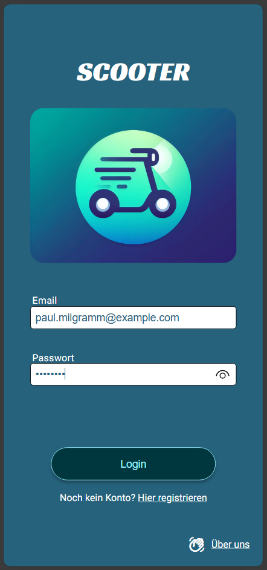
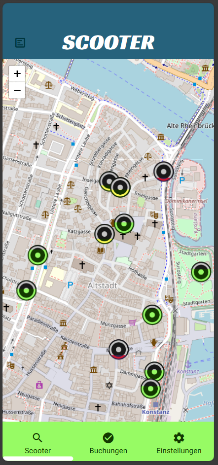
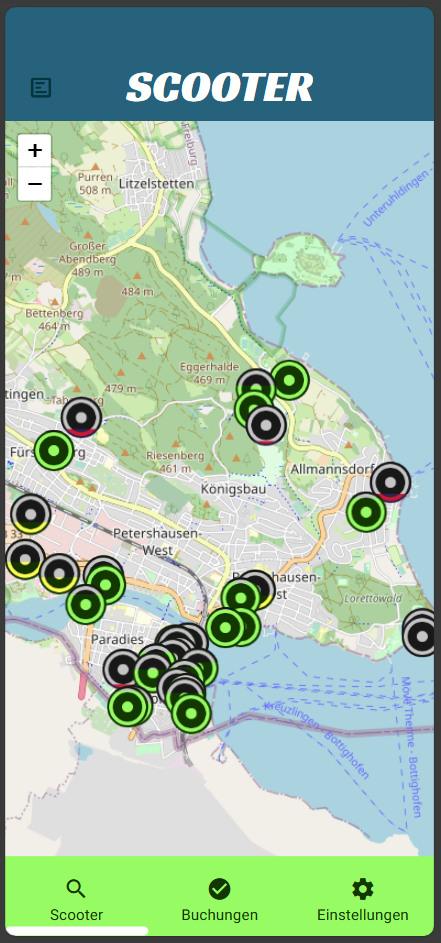
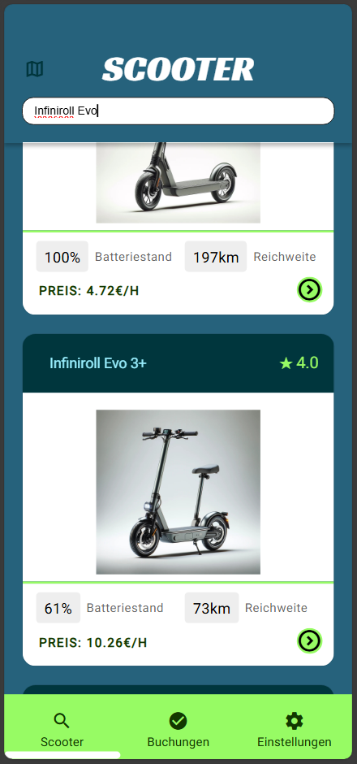
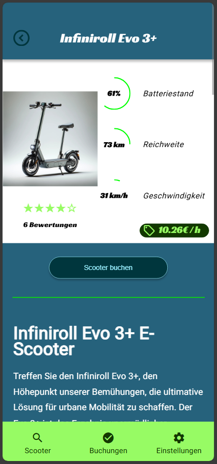
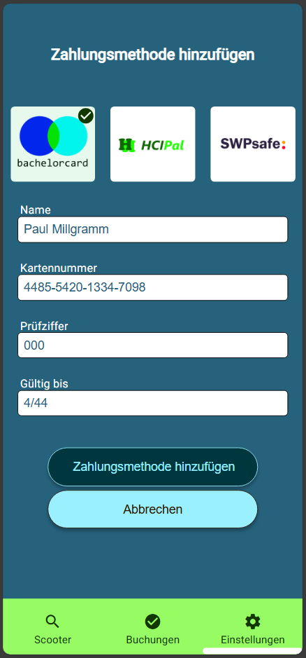
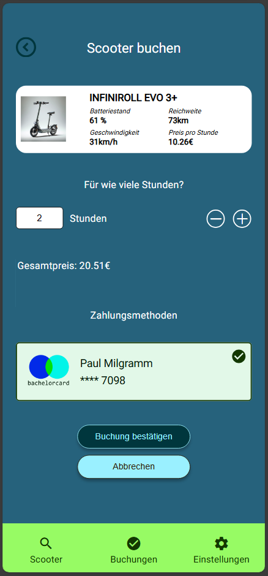
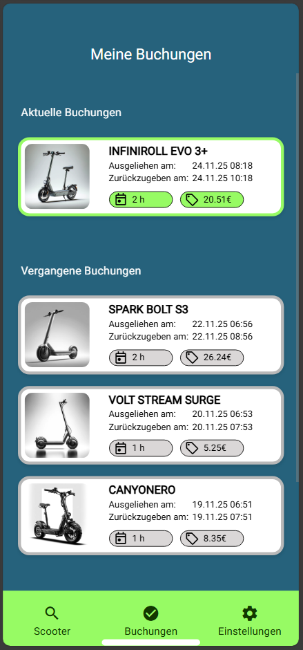
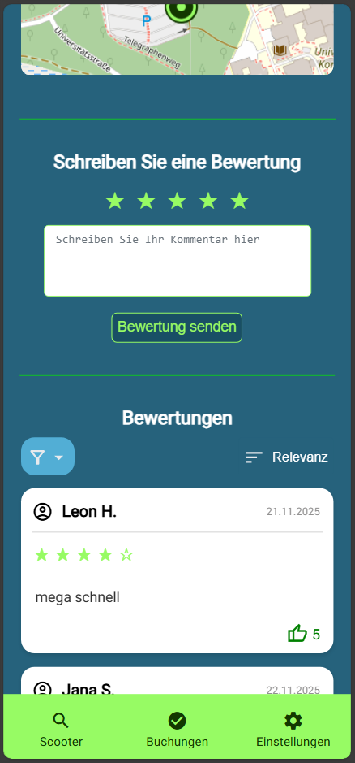
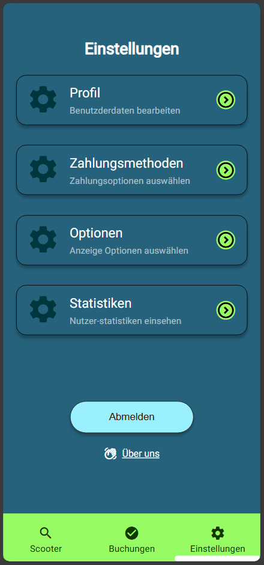

# University Team-Project: Scooter App

This project was developed as part of the *Softwareprojekt* course at the University of Konstanz in a team of five students.  
It is a scooter web app with an interactive map of Konstanz that shows available scooters with specific details and allows users to rent them.

## Demo-Video of App 

## Screenshots of App

  
  
  
  
  

  
  
  
  
  

